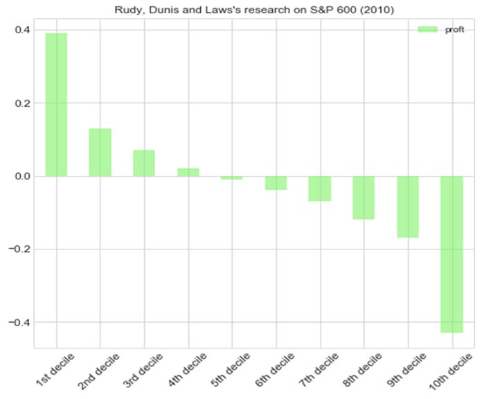
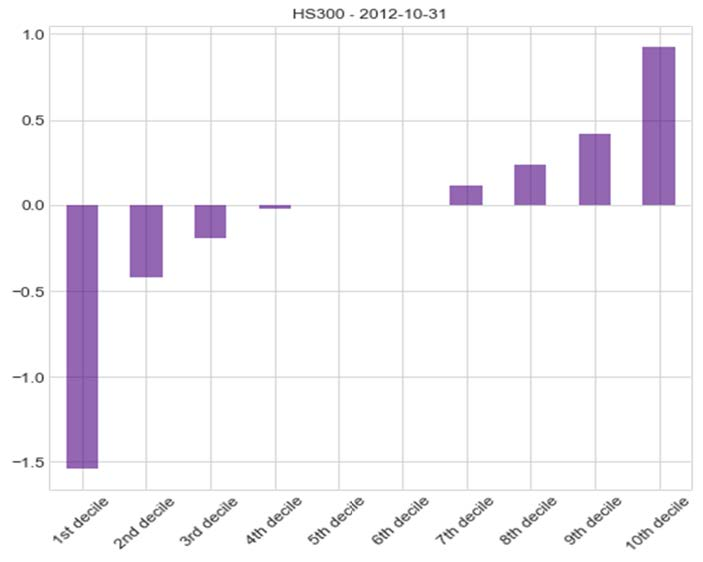
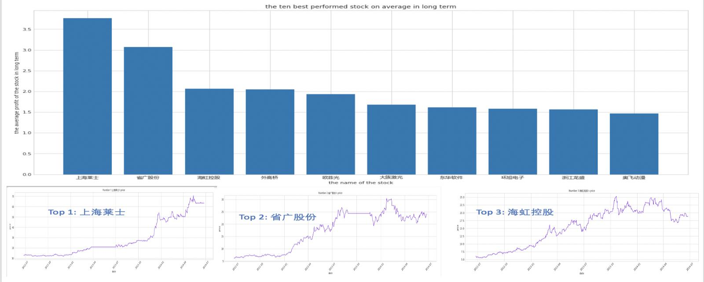
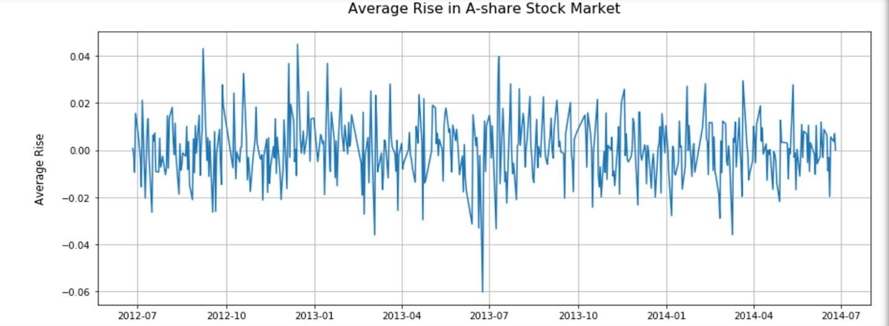
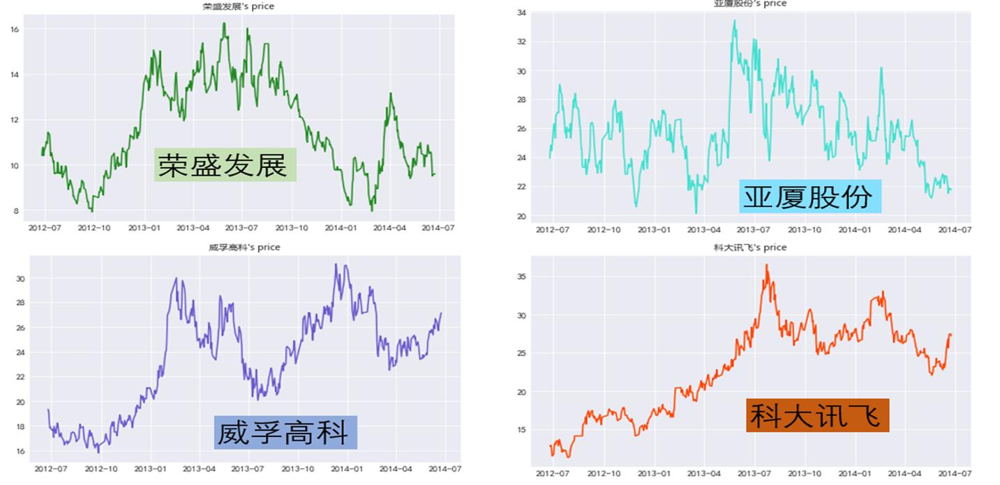
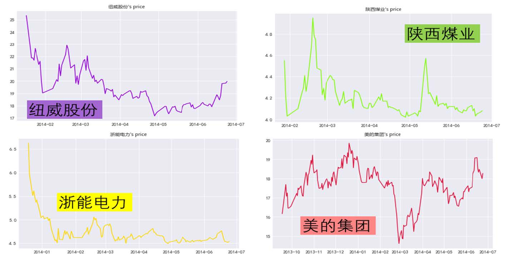

# Trading strategy: Half-day-reversal

## Introduction

Investors’ attention to the market can influence the stock market. In the real world, investors can overreact or underreact to the market. In fact, according to Dellavigna and Pollet (2009) have found that investor behavioral biases have real effects on the stock market. Therefore, contrarian strategies can benefit from overreaction to isolated events. Studies like those from Dunis, Laws and Rudy (2011); Ramirah, Mugwagwa and Naughton (2011); and Kudryavtsev (2012) have explored this idea and suggest that the information during the open-to-close (day) period can be used to profit by holding the worst performing stocks during that span of time and then selling them at the end of the following close-to-open (night) period. However, in our research we found that different from the US stock market, the Chinese one works quite the opposite. Following the model of Dunis, Laws and Rudy (2011), we calculated the performance of the companies in one single day and then grouped it into deciles from worst to best performance. But different to our expectations, after selling the stocks, we found that the worst performing stocks had negative return, while the best performing ones had the best profit. Which means that, opposite to the overreaction from investors in the US stock market, China’s investors may tend to underreact to the open-to-close performance from the market, so the stocks tend to follow the same trend during the whole day.

## Background

The stock market is the place where people buy and sell stocks at different prices. The differences between the price people buy it or sell it is the money people can profit or lose. As a matter of fact, the price of the stock will change every second or even more frequently. People’s attitude towards the stock price is very emotional. When the stock price decreases, they always intend to sell it, since they are afraid the price will keep dropping. However, when the price raises, they will buy the stock immediately because they believe the price will continue raising.
However, the half-day reversal strategy suggests the opposite way. What actually happens to a stock during the night, after it fell awfully during a market session, is a contrarian reaction. Besides, financial research paper shows that the difference between the close price and open price can be exploited profitably (Dunis, Laws & Rudy, 2011). Therefore, the simple trading strategy teaches people that they should buy the worst performed stock of that day at the close price and keep it overnight. They can sell it at the open price on the following day and they can make much profit from it (Kudryavtsev, 2012).

## Design and Implementation

We received our readings and data from Mike. After reading the background information and the example of half-day reversal strategy used in the S&P 600, we come up with our simple design for this project. The main objective for our project is to test whether half-day reversal strategy is applicable in Chinese stock market and find what’s the best profit we can make in one single day in a stock market through different profit strategy. We choose HS300 as the main database we used in this project. It includes the opening price and closing price of three hundred stocks in Shanghai and Shenzhen stock market. To solve the second question, we put forward two profit strategies, which are value investing and short selling. Then we will calculate the best profit by doing data analysis according to the models of these two strategies.
To carry out this plan, first, we cleaned the data to eliminate useless information. Then, we decided to cut the implementation into three parts. Firstly, we will analyze the overall performance and the market trend of the Chinese stock market by calculating the best performed stock on average and average daily rise of all stocks in these three years.
Secondly, we will test whether some strategies which are theoretically or intuitively feasible can be applied to Chinese stock markets. To test the half-day reversal strategy, we will first turn this strategy into the studying question: is it right to sell stock that has a large decrease? And we will solve it by calculating the difference between close price and open price every single day. Then, we need to find the difference of value between their close price of and the open price of the next day. At last, we can determine whether this strategy is feasible by calculating how many stocks have the positive returns through overnight trading. Inspired by the half-day reversal strategy, we also come up with another strategy which is selling the stocks that have large increase. The approach for test this strategy is similar to the one that is mentioned above to test the half-day reversal strategy. We just need to change the first step into finding the date when stocks that rise the in one single day.
Thirdly, we will calculate the best profit in one single day for both short selling and value investing. Short selling refers to the short-term investment. The theory of short selling is first selling the stock when its value is high and pay back when it drops. So, we will get the best profit through this approach by calculating the average profit of all stocks, divide them by deciles, ranking the stocks by their daily performance and use the ones that performed the worse every day. The value investing refers to the long-term investment and it works the opposite way to the short selling. So, we can use the same ranking but now use the ones with the best performance.

## Results

### Testing the Half Day Reversal Strategy in Chinese Stock Market.

We based our research on a contrarian strategy hypothesis. As stated in a study from Rudy et al. (2011), during the open-to-close (day) period in the S&P 600 stock market in one single day, overreaction from the investors would change the trend in the following close-to-open (night) period. This was based on the fact that the top 10% worst performing stocks during the day would be the most profitable at the end of the night period (Figure 1).
Although, after doing our research, we analyzed each day and found that they produce quite the opposite results. In the Chinese stock market, particularly the HS300, we found that the top 10% worst performing strategies during the day were the ones whose price dropped the most during the night, thus had negative return. On the other hand, the ones that had the best performance during the day were the ones that grew up the most at the end of the night period (Figure 2).

<figure>
  
  
  <figcaption>Fig.1. (Rudy, Dunis and Laws’s research on S&P 600) Trend of the stock during one day in the S&P 600 in 2010, source: Dunis, C. L., Laws, J., & Rudy, J. (2011). Profitable mean reversion after large price drops: A story of day and night in the S&P 500, 400 MidCap and 600 SmallCap Indices. Journal of Asset Management, 12(3), 185–202. doi: 10.1057/jam.2011.15. Figure 2: (HS300-2012-10-31) Our analysis on information from HS300 stock market from the date of October 31st of 2010.</figcaption>
</figure>

After analyzing the data, we found that the ratio that selling a profit/loss after a share price falls shows a fluctuation. Among total 300 companies, only 126 companies show the ratio of positive returns, which means selling stocks immediately after they fall is a risky choice. We also found that the ratio that selling a profit/loss after a share price rises shows a fluctuation. Among total 300 companies, there are 174 companies shows the ratio of positive returns, which means selling stocks immediately after they increase is also a risky strategy.

### Ten best performed stocks in the long term

<figure>
  
  <figcaption>Fig.3. The Ten Best Performed Stock in the long term</figcaption>
</figure>

As can be seen in Figure 3, the ten-best performed stock in three years from 2014 to 2017 is listed in the bar. The average daily profit of the best stock is more than 3.5%, and the average profit of these ten stocks can reach nearly 2% per day. Due to the limited space, we only listed the trend of three best performed stocks of three years. Though, there are some bouncing in the price, the overall trend of these three stocks are raising at a relatively high speed. Therefore, these ten stocks are profitable for long term value investment.

### Market trend

<figure>
  
  <figcaption>Fig.4. The Average Rise in A Share Stock Market</figcaption>
</figure>

As can be seen from Figure 4, the line chart here shows the average daily rise of all stocks over 3 years illustrating the overall trend of the HS300 stock market from 2014 to 2017. To achieve the data of average daily rise of all stocks in one single day, I first calculate the value of difference between today's closing price and yesterday's closing price for every stock. Then I got the daily rise for one stock by dividing the value of difference by yesterday's closing price. The average daily rise for all stocks is calculated by adding up the average rise of each stock and dividing by the number of stocks. The final line chart shows the change of the average daily rise for all stocks in these three years.
From the line chart, we find that this stock market as a whole is volatile and widely divergent. On the one hand, the maximum daily gain is more than 6%, which appear on December 14, 2014. On the other hand, the maximum daily decline is about 4.5%, which was appear on June 24, 2013.Also, since the earnings of this stock market varies greatly between positive and negative in short periods, it is suitable for investors to seize the right time to do short - term investment in this stock market.

### Best open-to-close daily performance stocks from June 2012 to June 2014

The companies that are more frequently in the 10% best performance during a single day, thus better for value investing, during the period of 2012-06 to 2014-06. i.e. The companies that are more frequently within the 10th decile (Figure 2) each day are 荣盛发展, 亚厦股份, 威孚高科 and 科大讯飞. The general trend of these four companies are displayed on figures 4 to 8.
Similarly, the companies that are more frequently in the 10% worst performance during the day, thus better for short-selling, during the period of 2012-06 to 2014-06, are 纽威股份, 陕西煤业, 浙能电力 and 美的集团. The general trend of these four companies are displayed on figures 9 to 12.
The main difference, between the best and the worse performing companies, is that the first ones have more sudden rises in their price, as a result, their stocks are mostly at a relatively high price; on the other hand, the last ones have more sudden drops in their price, thus, their price is mostly at a relatively low price.

<figure>
  
  <figcaption>Fig.5. 荣盛发展’s general trend in the stock market from June 2012 to June 2014. Figure 6, 亚厦股份’s general trend in the stock market from June 2012 to June 2014. Figure 7, 威孚高科’s general trend in the stock market from June 2012 to June 2014. Figure 8, 科大讯飞’s general trend in the stock market from June 2012 to June 2014.</figcaption>
</figure>

<figure>
  
  <figcaption>纽威股份’s general trend in the stock market from January to June 2014. Figure 10, 陕西煤业’s general trend in the stock market from January to June 2014. Figure 11, 浙能电力’s general trend in the stock market from December 2013 to June 2014. Figure 12, 美的集团’s general trend in the stock market from September 2013 to June 2014.</figcaption>
</figure>

## Conclusions

Although the model for the Half-Day Reversal Strategy might be effective in the US stock market, we cannot extrapolate the model to the Chinese market; this suggests that the Chinese stock market works differently from the US. One explanation for this could be that the last one is almost entirely dependent on the investors, while the first one is mainly influenced by the Chinese Government. Another possible explanation is that the US investors tend to overreact to the drops or are aware of them and expect that it will recover during the other half of the day, while China’s investors are more likely to underreact to the half-day performance.
In order to profit in the short-term (close-to-open), we should not use the half-day reversal strategy, yet we can benefit from that information. In order to profit from the HS300 stock, we should avoid investing in the worst performing stocks since those are likely to keep dropping its price, while we should invest on the best performing stocks since those are likely to keep growing in price; though, we can also profit from doing short-selling by borrowing the worst performing stocks during the day and sell them, then pay back the following day at the open price once the prices have dropped.
Finally, since our initial objective was to find what are the maximum profit we can make in one single day, our research concludes that by doing value investing we can profit a 1.171% per day on average, while if we do short-selling we can expect a return of 1.226% per day on average.

## Individual Contribution
Muzi Tao plotted the market trends in code and write the design and implementation part as well as market trend part in result and discussion in final report.
Ruoxian Jiang plotted the best performed 10 stocks on average, did the PPT for the presentation and wrote the background as well as the result and discussion of what I have found in the final report.
Carlos Gustavo Salas Flores collaborated in cleaning the database, testing the half-day reversal strategy within the HS300 database, ranking the daily performance as well as writing the introduction, results and conclusions.
Yifu Wang plotted the profit ratio of selling the decrease stock in the close time and also do the presentation of conclusion part in the final report.
Yi Wei plotted the profit ratio of selling the increase stock in the close time and also do presentation of the half-day reversal strategy part.

## References

Dellavigna, S., & Pollet, J.M. (2009), Investor Inattention and Friday Earnings Announcements. The Journal of Finance, 64: 709-749. doi:10.1111/j.1540-6261.2009.01447.x
Dunis, C. L., Laws, J., & Rudy, J. (2011). Profitable mean reversion after large price drops: A story of day and night in the S&P 500, 400 MidCap and 600 SmallCap indices. Journal of Asset Management, 12(3), 185-202. doi:10.1057/jam.2011.15
Ramiah, V., Mugwagwa, T., & Naughton, T. (2011). Hot and Cold Strategies: Australian Evidence. Review of Pacific Basin Financial Markets and Policies, 14(02), 271–295. doi: 10.1142/s0219091511002251
Kudryavtsev, A. (2012). Overnight Stock Price Reversals. Journal of Advanced Studies in Finance, III(2). doi: 10.2478/v10259-012-0011-1
